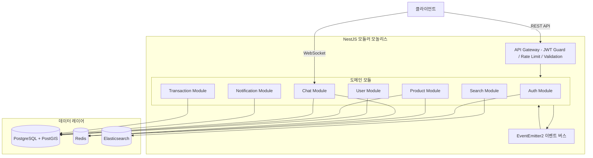
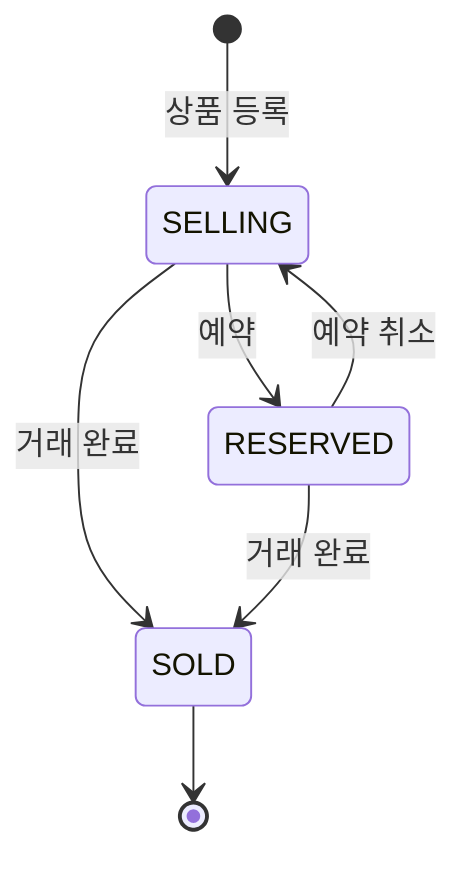

# 기술 설계 문서: 당근마켓 스타일 지역 기반 중고거래 플랫폼

## 개요 (Overview)

본 문서는 지역 기반 중고거래 플랫폼의 백엔드 시스템 기술 설계를 정의합니다. NestJS 모듈러 모놀리스 아키텍처를 기반으로, 7개의 도메인 모듈(Auth, User, Product, Chat, Search, Notification, Transaction)이 이벤트 버스를 통해 느슨하게 결합됩니다.

핵심 기술적 도전 과제:
- PostGIS 기반 반경 6km 위치 검색과 피드 캐싱 전략
- WebSocket + Redis Pub/Sub 기반 실시간 채팅의 수평 확장
- Elasticsearch 동기화를 통한 전문 검색
- 매너온도 계산의 정확성과 범위 제한 보장
- 상품 상태 전이의 무결성 보장

## 아키텍처 (Architecture)

### 시스템 아키텍처: 모듈러 모놀리스



### 레이어 아키텍처

각 모듈은 3-레이어 아키텍처를 따릅니다:

```
Controller (HTTP/WS 요청 처리, DTO 검증)
    ↓
Service (비즈니스 로직, 이벤트 발행)
    ↓
Repository (Prisma를 통한 데이터 접근)
```

### 모듈 간 통신

모듈 간 직접 의존을 최소화하고, NestJS `EventEmitter2`를 통한 이벤트 기반 통신을 사용합니다.

| 이벤트 | 발행 모듈 | 구독 모듈 | 설명 |
|--------|-----------|-----------|------|
| `ProductCreatedEvent` | Product | Search, Notification | 상품 생성 시 ES 인덱싱 및 관심 카테고리 알림 |
| `ProductUpdatedEvent` | Product | Search | 상품 수정 시 ES 인덱스 동기화 |
| `ProductDeletedEvent` | Product | Search | 상품 삭제 시 ES 인덱스 제거 |
| `TransactionCompletedEvent` | Product | Transaction, User, Notification | 거래 완료 시 거래 레코드 생성, 후기 요청 알림 |
| `ChatMessageSentEvent` | Chat | Notification, Product | 메시지 발송 시 푸시 알림, chat_count 증가 |
| `FavoriteCreatedEvent` | Product | Product | 관심 등록 시 favorite_count 증가 |
| `ReviewCreatedEvent` | Transaction | User | 후기 작성 시 매너온도 업데이트 |

### 프로젝트 디렉토리 구조

```
daangn-app/src/
├── main.ts
├── app.module.ts
├── common/
│   ├── common.module.ts
│   ├── decorators/          # @CurrentUser 등 커스텀 데코레이터
│   ├── dto/                 # PaginationDto, ApiResponse
│   ├── filters/             # GlobalExceptionFilter
│   ├── guards/              # JwtAuthGuard
│   ├── interceptors/        # ResponseTransformInterceptor
│   └── events/              # 이벤트 클래스 정의
├── auth/
│   ├── auth.module.ts
│   ├── auth.controller.ts
│   ├── auth.service.ts
│   └── dto/
├── user/
│   ├── user.module.ts
│   ├── user.controller.ts
│   ├── user.service.ts
│   └── dto/
├── product/
│   ├── product.module.ts
│   ├── product.controller.ts
│   ├── product.service.ts
│   └── dto/
├── chat/
│   ├── chat.module.ts
│   ├── chat.controller.ts
│   ├── chat.service.ts
│   ├── chat.gateway.ts      # WebSocket Gateway (Socket.io)
│   └── dto/
├── search/
│   ├── search.module.ts
│   ├── search.controller.ts
│   ├── search.service.ts
│   └── dto/
├── notification/
│   ├── notification.module.ts
│   ├── notification.controller.ts
│   ├── notification.service.ts
│   └── dto/
├── transaction/
│   ├── transaction.module.ts
│   ├── transaction.controller.ts
│   ├── transaction.service.ts
│   └── dto/
└── prisma/
    ├── prisma.module.ts
    ├── prisma.service.ts
    └── schema.prisma
```


## 컴포넌트 및 인터페이스 (Components and Interfaces)

### 1. Common Module

공통 모듈은 모든 도메인 모듈이 공유하는 인프라 컴포넌트를 제공합니다.

#### 공통 응답 형식

```typescript
// common/dto/api-response.dto.ts
interface ApiResponse<T> {
  status: 'success' | 'error';
  data: T | null;
  message: string | null;
}
```

#### 커서 기반 페이지네이션

```typescript
// common/dto/cursor-pagination.dto.ts
class CursorPaginationDto {
  cursor?: string;   // 마지막 항목의 ID 또는 타임스탬프
  limit: number;     // 기본값 20, 최대 50
}

class CursorPaginatedResponse<T> {
  items: T[];
  nextCursor: string | null;
  hasMore: boolean;
}
```

#### 글로벌 예외 필터

`GlobalExceptionFilter`는 모든 예외를 잡아 일관된 `ApiResponse` 형식으로 변환합니다. Prisma 예외(`PrismaClientKnownRequestError`)도 적절한 HTTP 상태 코드로 매핑합니다.

#### JWT Auth Guard

`JwtAuthGuard`는 `@nestjs/passport`의 `AuthGuard('jwt')`를 확장하여, 유효하지 않거나 만료된 토큰에 대해 401 응답을 반환합니다. `@Public()` 데코레이터가 적용된 엔드포인트는 인증을 건너뜁니다.

### 2. Auth Module

#### 컨트롤러

| 엔드포인트 | 메서드 | 설명 | 인증 |
|-----------|--------|------|------|
| `/auth/sms/send` | POST | SMS 인증번호 발송 | 불필요 |
| `/auth/sms/verify` | POST | 인증번호 확인 + JWT 발급 | 불필요 |
| `/auth/refresh` | POST | Access Token 갱신 | Refresh Token |
| `/auth/logout` | POST | 로그아웃 (Refresh Token 삭제) | 필요 |

#### 서비스 로직

```typescript
class AuthService {
  // SMS 인증번호 발송
  // 1. 전화번호 형식 검증 (한국 010-XXXX-XXXX)
  // 2. Redis에서 1분 이내 재발송 여부 확인 → 거부 시 남은 시간 반환
  // 3. 6자리 랜덤 인증번호 생성
  // 4. Redis에 저장 (키: sms:{phone}, TTL: 180초)
  // 5. 쿨다운 키 설정 (키: sms:cooldown:{phone}, TTL: 60초)
  async sendSmsCode(phone: string): Promise<{ expiresIn: number }>

  // SMS 인증번호 확인 + 로그인
  // 1. Redis에서 인증번호 조회 → 만료 시 401
  // 2. 5회 연속 실패 확인 (키: sms:fail:{phone}) → 차단 시 429
  // 3. 인증번호 비교 → 불일치 시 실패 카운트 증가 + 401
  // 4. 사용자 조회 또는 신규 생성 (매너온도 36.5 초기화)
  // 5. JWT Access Token (1h) + Refresh Token (14d) 발급
  // 6. Refresh Token을 Redis에 저장
  // 7. Redis에서 인증번호 및 실패 카운트 삭제
  async verifySmsCode(phone: string, code: string): Promise<TokenPair>

  // 토큰 갱신: Refresh Token 검증 → Redis 존재 확인 → 새 Access Token 발급
  async refreshToken(refreshToken: string): Promise<{ accessToken: string }>

  // 로그아웃: Redis에서 Refresh Token 삭제
  async logout(userId: string): Promise<void>
}
```

#### Redis 키 설계

| 키 패턴 | 용도 | TTL |
|---------|------|-----|
| `sms:{phone}` | SMS 인증번호 저장 | 180초 |
| `sms:cooldown:{phone}` | 재발송 쿨다운 | 60초 |
| `sms:fail:{phone}` | 연속 실패 카운트 | 1800초 |
| `refresh:{userId}` | Refresh Token | 14일 |

### 3. User Module

#### 컨트롤러

| 엔드포인트 | 메서드 | 설명 | 인증 |
|-----------|--------|------|------|
| `/users/me` | GET | 내 프로필 조회 | 필요 |
| `/users/me` | PUT | 프로필 수정 | 필요 |
| `/users/me/locations` | POST | 동네 인증 | 필요 |
| `/users/me/locations/:id/primary` | PATCH | 주 동네 변경 | 필요 |
| `/users/:id` | GET | 타 사용자 프로필 조회 | 필요 |
| `/users/:id/block` | POST | 사용자 차단 | 필요 |
| `/users/:id/block` | DELETE | 차단 해제 | 필요 |
| `/users/:id/report` | POST | 사용자 신고 | 필요 |

#### 서비스 로직

```typescript
class UserService {
  // 동네 인증
  // 1. GPS 좌표를 PostGIS ST_DWithin으로 행정동 반경 검증
  // 2. 역지오코딩으로 시/도, 시/군/구, 읍/면/동 추출
  // 3. 사용자당 최대 2개 동네 제한 확인
  // 4. 위치 정보 저장 + verified = true
  async verifyLocation(userId: string, lat: number, lng: number): Promise<UserLocation>

  // 매너온도 업데이트
  // 1. 매너 태그별 가중치 계산 (긍정: +0.1~0.5, 부정: -0.1~0.5)
  // 2. 현재 매너온도에 가중치 적용
  // 3. 범위 클램핑: Math.max(0, Math.min(99, newTemp))
  async updateMannerTemperature(userId: string, mannerTags: string[]): Promise<number>

  // 사용자 차단: 자기 자신 차단 방지 → 차단 관계 저장
  async blockUser(userId: string, targetId: string): Promise<void>
}
```

#### 매너온도 계산 규칙

| 매너 태그 | 온도 변화 |
|-----------|----------|
| `친절해요` | +0.3°C |
| `시간 약속을 잘 지켜요` | +0.3°C |
| `응답이 빨라요` | +0.2°C |
| `상품 상태가 설명과 같아요` | +0.3°C |
| `불친절해요` | -0.3°C |
| `시간 약속을 안 지켜요` | -0.3°C |
| `상품 상태가 설명과 달라요` | -0.5°C |

### 4. Product Module

#### 컨트롤러

| 엔드포인트 | 메서드 | 설명 | 인증 |
|-----------|--------|------|------|
| `/products` | GET | 상품 피드 | 필요 |
| `/products` | POST | 상품 등록 | 필요 |
| `/products/:id` | GET | 상품 상세 | 필요 |
| `/products/:id` | PUT | 상품 수정 | 필요 (소유자) |
| `/products/:id` | DELETE | 상품 삭제 | 필요 (소유자) |
| `/products/:id/status` | PATCH | 상태 변경 | 필요 (소유자) |
| `/products/:id/bump` | POST | 끌어올리기 | 필요 (소유자) |
| `/products/:id/favorite` | POST | 관심 토글 | 필요 |
| `/products/upload-url` | POST | Presigned URL 발급 | 필요 |

#### 서비스 로직

```typescript
class ProductService {
  // 상품 피드: PostGIS ST_DWithin(6000m) + bumped_at DESC + 차단 사용자 필터링 + Redis 캐싱(30초)
  async getFeed(userId: string, query: FeedQueryDto): Promise<CursorPaginatedResponse<Product>>

  // 상품 등록: 동네 인증 확인 → 입력 검증 → 생성 → ProductCreatedEvent 발행
  async createProduct(userId: string, dto: CreateProductDto): Promise<Product>

  // 상태 변경: 허용 전이만 수행, SOLD 시 TransactionCompletedEvent 발행
  // 허용: SELLING→RESERVED, SELLING→SOLD, RESERVED→SOLD, RESERVED→SELLING
  async changeStatus(userId: string, productId: string, status: ProductStatus): Promise<Product>

  // 끌어올리기: 판매중 확인 → 24시간 경과 확인 → bumped_at 갱신 → 캐시 무효화
  async bumpProduct(userId: string, productId: string): Promise<Product>

  // 관심 토글: 자기 상품 방지 → 존재 시 삭제/미존재 시 생성 → 카운트 조정
  async toggleFavorite(userId: string, productId: string): Promise<{ isFavorited: boolean }>
}
```

#### 상품 상태 전이 다이어그램



### 5. Chat Module

#### REST 컨트롤러

| 엔드포인트 | 메서드 | 설명 | 인증 |
|-----------|--------|------|------|
| `/chat/rooms` | GET | 채팅방 목록 | 필요 |
| `/chat/rooms` | POST | 채팅방 생성 | 필요 |
| `/chat/rooms/:id/messages` | GET | 메시지 히스토리 | 필요 |

#### WebSocket Gateway

```typescript
@WebSocketGateway({ namespace: '/chat', cors: true })
class ChatGateway {
  // 연결 시 JWT 검증 → 실패 시 연결 거부
  async handleConnection(client: Socket): Promise<void>

  // 채팅방 입장 → 읽지 않은 메시지 읽음 처리
  @SubscribeMessage('join_room')
  async handleJoinRoom(client: Socket, roomId: string): Promise<void>

  // 메시지 전송: DB 저장 → last_message 갱신 → Redis Pub/Sub 브로드캐스트
  // → 상대방 온라인 시 실시간 전달, 오프라인 시 ChatMessageSentEvent 발행
  @SubscribeMessage('send_message')
  async handleSendMessage(client: Socket, payload: SendMessageDto): Promise<void>

  // 읽음 확인: read_at 갱신 → 상대방에게 읽음 이벤트 전달
  @SubscribeMessage('read_messages')
  async handleReadMessages(client: Socket, roomId: string): Promise<void>
}
```

#### Redis 키 설계 (Chat)

| 키 패턴 | 용도 | TTL |
|---------|------|-----|
| `online:{userId}` | 온라인 상태 (socketId) | 없음 (disconnect 시 삭제) |
| `chat:{roomId}` (Pub/Sub 채널) | 실시간 메시지 브로드캐스트 | - |

### 6. Search Module

#### 컨트롤러

| 엔드포인트 | 메서드 | 설명 | 인증 |
|-----------|--------|------|------|
| `/search` | GET | 상품 검색 | 필요 |
| `/search/suggest` | GET | 자동완성 | 필요 |
| `/search/popular` | GET | 인기 검색어 | 필요 |

#### Elasticsearch 인덱스 설계

```json
{
  "index": "products",
  "mappings": {
    "properties": {
      "id": { "type": "keyword" },
      "title": { "type": "text", "analyzer": "nori" },
      "description": { "type": "text", "analyzer": "nori" },
      "category": { "type": "keyword" },
      "price": { "type": "integer" },
      "status": { "type": "keyword" },
      "location": { "type": "geo_point" },
      "region_depth3": { "type": "keyword" },
      "bumped_at": { "type": "date" },
      "seller_id": { "type": "keyword" }
    }
  },
  "settings": {
    "analysis": {
      "analyzer": {
        "nori": {
          "type": "custom",
          "tokenizer": "nori_tokenizer",
          "filter": ["nori_readingform", "lowercase"]
        }
      }
    }
  }
}
```

- 전문 검색: `multi_match` (title^3, description) + nori 한국어 형태소 분석
- 필터: `bool.filter` (지역, 카테고리, 가격 범위, 상태)
- 정렬: `bumped_at` (최신순), `_score` (관련도순), `_geo_distance` (거리순)
- 자동완성: `prefix` 쿼리 (최대 10개)
- 인기 검색어: Redis Sorted Set (`ZINCRBY popular_keywords:{date}`, TTL: 1시간)

### 7. Notification Module

#### 컨트롤러

| 엔드포인트 | 메서드 | 설명 | 인증 |
|-----------|--------|------|------|
| `/notifications` | GET | 알림 목록 | 필요 |
| `/notifications/settings` | GET | 알림 설정 조회 | 필요 |
| `/notifications/settings` | PUT | 알림 설정 변경 | 필요 |
| `/notifications/device-token` | POST | FCM 디바이스 토큰 등록 | 필요 |

#### 이벤트 핸들러

- `ChatMessageSentEvent`: 수신자 오프라인 + 채팅 알림 on → FCM 푸시 발송
- `TransactionCompletedEvent`: 구매자에게 후기 작성 요청 알림
- `ProductPriceChangedEvent`: 찜한 사용자들에게 가격 변경 알림

### 8. Transaction Module

#### 컨트롤러

| 엔드포인트 | 메서드 | 설명 | 인증 |
|-----------|--------|------|------|
| `/transactions` | GET | 거래 내역 (구매/판매 구분) | 필요 |
| `/transactions/:id/review` | POST | 거래 후기 작성 | 필요 |

#### 서비스 로직

- `TransactionCompletedEvent` 수신 → 거래 레코드 생성
- 후기 작성: 거래 참여자 확인(403) → 중복 확인(409) → 저장 → `ReviewCreatedEvent` 발행


## 데이터 모델 (Data Models)

### Prisma 스키마

```prisma
generator client {
  provider        = "prisma-client-js"
  previewFeatures = ["postgresqlExtensions"]
}

datasource db {
  provider   = "postgresql"
  url        = env("DATABASE_URL")
  extensions = [postgis]
}

// ─── 사용자 ───

model User {
  id            String   @id @default(uuid()) @db.Uuid
  phone         String   @unique @db.VarChar(20)
  nickname      String   @db.VarChar(50)
  profileImage  String?  @map("profile_image") @db.VarChar(500)
  mannerTemp    Decimal  @default(36.5) @map("manner_temp") @db.Decimal(4, 1)
  createdAt     DateTime @default(now()) @map("created_at") @db.Timestamptz()
  updatedAt     DateTime @updatedAt @map("updated_at") @db.Timestamptz()

  locations          UserLocation[]
  products           Product[]        @relation("seller")
  buyerChatRooms     ChatRoom[]       @relation("buyer")
  sellerChatRooms    ChatRoom[]       @relation("seller_chat")
  sentMessages       ChatMessage[]
  favorites          Favorite[]
  reviewsWritten     Review[]         @relation("reviewer")
  reviewsReceived    Review[]         @relation("target")
  blocksInitiated    UserBlock[]      @relation("blocker")
  blocksReceived     UserBlock[]      @relation("blocked")
  reports            Report[]
  notifications      Notification[]
  notificationSetting NotificationSetting?
  deviceTokens       DeviceToken[]

  @@map("users")
}

model UserLocation {
  id           String    @id @default(uuid()) @db.Uuid
  userId       String    @map("user_id") @db.Uuid
  latitude     Float
  longitude    Float
  regionDepth1 String?   @map("region_depth1") @db.VarChar(50)
  regionDepth2 String?   @map("region_depth2") @db.VarChar(50)
  regionDepth3 String?   @map("region_depth3") @db.VarChar(50)
  verified     Boolean   @default(false)
  verifiedAt   DateTime? @map("verified_at") @db.Timestamptz()
  isPrimary    Boolean   @default(true) @map("is_primary")
  createdAt    DateTime  @default(now()) @map("created_at") @db.Timestamptz()

  user User @relation(fields: [userId], references: [id], onDelete: Cascade)

  @@map("user_locations")
}

model UserBlock {
  id        String   @id @default(uuid()) @db.Uuid
  blockerId String   @map("blocker_id") @db.Uuid
  blockedId String   @map("blocked_id") @db.Uuid
  createdAt DateTime @default(now()) @map("created_at") @db.Timestamptz()

  blocker User @relation("blocker", fields: [blockerId], references: [id], onDelete: Cascade)
  blocked User @relation("blocked", fields: [blockedId], references: [id], onDelete: Cascade)

  @@unique([blockerId, blockedId])
  @@map("user_blocks")
}

model Report {
  id         String   @id @default(uuid()) @db.Uuid
  reporterId String   @map("reporter_id") @db.Uuid
  targetId   String   @map("target_id") @db.Uuid
  reason     String   @db.Text
  createdAt  DateTime @default(now()) @map("created_at") @db.Timestamptz()

  reporter User @relation(fields: [reporterId], references: [id])

  @@map("reports")
}

// ─── 상품 ───

enum ProductStatus {
  SELLING
  RESERVED
  SOLD
}

model Product {
  id            String        @id @default(uuid()) @db.Uuid
  sellerId      String        @map("seller_id") @db.Uuid
  title         String        @db.VarChar(200)
  description   String?       @db.Text
  price         Int           @default(0)
  category      String        @db.VarChar(50)
  status        ProductStatus @default(SELLING)
  latitude      Float?
  longitude     Float?
  regionDepth3  String?       @map("region_depth3") @db.VarChar(50)
  viewCount     Int           @default(0) @map("view_count")
  chatCount     Int           @default(0) @map("chat_count")
  favoriteCount Int           @default(0) @map("favorite_count")
  createdAt     DateTime      @default(now()) @map("created_at") @db.Timestamptz()
  updatedAt     DateTime      @updatedAt @map("updated_at") @db.Timestamptz()
  bumpedAt      DateTime      @default(now()) @map("bumped_at") @db.Timestamptz()

  seller    User           @relation("seller", fields: [sellerId], references: [id])
  images    ProductImage[]
  chatRooms ChatRoom[]
  favorites Favorite[]
  reviews   Review[]

  @@map("products")
}

model ProductImage {
  id        String @id @default(uuid()) @db.Uuid
  productId String @map("product_id") @db.Uuid
  url       String @db.VarChar(500)
  sortOrder Int    @default(0) @map("sort_order")

  product Product @relation(fields: [productId], references: [id], onDelete: Cascade)

  @@map("product_images")
}

model Favorite {
  id        String   @id @default(uuid()) @db.Uuid
  userId    String   @map("user_id") @db.Uuid
  productId String   @map("product_id") @db.Uuid
  createdAt DateTime @default(now()) @map("created_at") @db.Timestamptz()

  user    User    @relation(fields: [userId], references: [id], onDelete: Cascade)
  product Product @relation(fields: [productId], references: [id], onDelete: Cascade)

  @@unique([userId, productId])
  @@map("favorites")
}

// ─── 채팅 ───

enum MessageType {
  TEXT
  IMAGE
  OFFER
}

model ChatRoom {
  id            String    @id @default(uuid()) @db.Uuid
  productId     String    @map("product_id") @db.Uuid
  buyerId       String    @map("buyer_id") @db.Uuid
  sellerId      String    @map("seller_id") @db.Uuid
  lastMessage   String?   @map("last_message") @db.Text
  lastMessageAt DateTime? @map("last_message_at") @db.Timestamptz()
  createdAt     DateTime  @default(now()) @map("created_at") @db.Timestamptz()

  product  Product       @relation(fields: [productId], references: [id])
  buyer    User          @relation("buyer", fields: [buyerId], references: [id])
  seller   User          @relation("seller_chat", fields: [sellerId], references: [id])
  messages ChatMessage[]

  @@unique([productId, buyerId])
  @@map("chat_rooms")
}

model ChatMessage {
  id        String      @id @default(uuid()) @db.Uuid
  roomId    String      @map("room_id") @db.Uuid
  senderId  String      @map("sender_id") @db.Uuid
  content   String      @db.Text
  type      MessageType @default(TEXT)
  readAt    DateTime?   @map("read_at") @db.Timestamptz()
  createdAt DateTime    @default(now()) @map("created_at") @db.Timestamptz()

  room   ChatRoom @relation(fields: [roomId], references: [id], onDelete: Cascade)
  sender User     @relation(fields: [senderId], references: [id])

  @@map("chat_messages")
}

// ─── 거래 ───

model Transaction {
  id        String   @id @default(uuid()) @db.Uuid
  productId String   @map("product_id") @db.Uuid
  buyerId   String   @map("buyer_id") @db.Uuid
  sellerId  String   @map("seller_id") @db.Uuid
  createdAt DateTime @default(now()) @map("created_at") @db.Timestamptz()

  reviews Review[]

  @@map("transactions")
}

model Review {
  id            String   @id @default(uuid()) @db.Uuid
  transactionId String   @map("transaction_id") @db.Uuid
  productId     String   @map("product_id") @db.Uuid
  reviewerId    String   @map("reviewer_id") @db.Uuid
  targetId      String   @map("target_id") @db.Uuid
  content       String?  @db.Text
  mannerTags    String[] @map("manner_tags")
  createdAt     DateTime @default(now()) @map("created_at") @db.Timestamptz()

  transaction Transaction @relation(fields: [transactionId], references: [id])
  product     Product     @relation(fields: [productId], references: [id])
  reviewer    User        @relation("reviewer", fields: [reviewerId], references: [id])
  target      User        @relation("target", fields: [targetId], references: [id])

  @@unique([transactionId, reviewerId])
  @@map("reviews")
}

// ─── 알림 ───

enum NotificationType {
  CHAT_MESSAGE
  PRICE_CHANGE
  REVIEW_REQUEST
  GENERAL
}

model Notification {
  id        String           @id @default(uuid()) @db.Uuid
  userId    String           @map("user_id") @db.Uuid
  type      NotificationType
  title     String           @db.VarChar(200)
  body      String           @db.Text
  data      Json?
  readAt    DateTime?        @map("read_at") @db.Timestamptz()
  createdAt DateTime         @default(now()) @map("created_at") @db.Timestamptz()

  user User @relation(fields: [userId], references: [id], onDelete: Cascade)

  @@map("notifications")
}

model NotificationSetting {
  id              String  @id @default(uuid()) @db.Uuid
  userId          String  @unique @map("user_id") @db.Uuid
  chatEnabled     Boolean @default(true) @map("chat_enabled")
  favoriteEnabled Boolean @default(true) @map("favorite_enabled")
  reviewEnabled   Boolean @default(true) @map("review_enabled")

  user User @relation(fields: [userId], references: [id], onDelete: Cascade)

  @@map("notification_settings")
}

model DeviceToken {
  id        String   @id @default(uuid()) @db.Uuid
  userId    String   @map("user_id") @db.Uuid
  token     String   @unique @db.VarChar(500)
  platform  String   @db.VarChar(20)
  createdAt DateTime @default(now()) @map("created_at") @db.Timestamptz()

  user User @relation(fields: [userId], references: [id], onDelete: Cascade)

  @@map("device_tokens")
}
```

### PostGIS 위치 기반 쿼리

Prisma는 PostGIS를 네이티브로 지원하지 않으므로, 위치 기반 쿼리는 `$queryRaw`를 사용합니다:

```typescript
// 반경 6km 이내 판매중 상품 조회 (Prisma raw query)
const products = await prisma.$queryRaw`
  SELECT p.*, u.nickname, u.manner_temp
  FROM products p
  JOIN users u ON p.seller_id = u.id
  WHERE p.status = 'SELLING'
    AND ST_DWithin(
      ST_MakePoint(p.longitude, p.latitude)::geography,
      ST_MakePoint(${lng}, ${lat})::geography,
      6000
    )
    AND p.seller_id NOT IN (
      SELECT blocked_id FROM user_blocks WHERE blocker_id = ${userId}
    )
  ORDER BY p.bumped_at DESC
  LIMIT ${limit}
`;
```

### 핵심 인덱스 (마이그레이션 후 Raw SQL로 생성)

```sql
-- PostGIS 위치 인덱스
CREATE INDEX idx_products_location ON products
  USING GIST(ST_MakePoint(longitude, latitude)::geography);
CREATE INDEX idx_products_bumped ON products(bumped_at DESC)
  WHERE status = 'SELLING';
CREATE INDEX idx_user_locations_coords ON user_locations
  USING GIST(ST_MakePoint(longitude, latitude)::geography);

-- 채팅 조회 최적화
CREATE INDEX idx_chat_messages_room ON chat_messages(room_id, created_at DESC);
CREATE INDEX idx_chat_rooms_buyer ON chat_rooms(buyer_id, last_message_at DESC);
CREATE INDEX idx_chat_rooms_seller ON chat_rooms(seller_id, last_message_at DESC);
```

